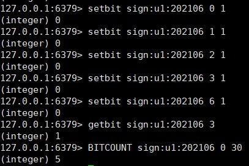

# Redis
1. 基础  
　　3.0是单线程，4.0支持混合持久，多线程异步删除，6.0支持多线程io
redis单线程是指网络的IO与键值的读写是一个线程执行的读取socket->解析请求->处理->写入socket.
3.0单线程快的原因：使用多路复用与非阻塞IO，多路复用监听多个socket连接客户端，这样可以使用一个线程来处理多个请求，避免上下
文的切换，单线程模型避免了加锁阻塞，省去了时间和性能上面的开销。大key删除导致阻塞，引入了异步概念。   
　　6.0的redis通过使用多个线程处理网络IO，单个线程处理主要的工作，既解决了网络IO问题，也保证了不用上下文切换的开销。默认是关
闭多线程的``io-threads-do-reads no`` 可开启  

2. 基础
    - 2.1 mysql与redis一致：先写(update)mysql,从mysql查询出数据再将查询结果写入到redis(先操作mysql再操作redis),查询的时候
    先查询redis,有则直接返回，无则查询mysql;查询mysql无，直接返回null,有则更新redis，保证下一次的缓存命中率。
    ``redis-cli --raw``解决客户端乱码
    - 2.2 借鉴DCL思想，解决缓存击穿问题
        ```$xslt
        public User findUserById2(Integer userId) {
                User user = null;
                //缓存key
                String key = CACHE_KEY_USER + userId;
                //1 查询redis
                user = (User) redisTemplate.opsForValue().get(key);
                //redis无，进一步查询mysql
                if (user == null) {
                    // DCL思想 保证第一个线程进来
                    synchronized (UserService.class) {
                        user = (User) redisTemplate.opsForValue().get(key);
                        if (user == null) {
                            user = userMapper.selectByPrimaryKey(userId);
                            if (user == null) {
                                return user;
                            } else {
                                // 写到Redis
                                redisTemplate.opsForValue().setIfAbsent(key, user, 7L, TimeUnit.DAYS);
                            }
                        }
                    }
                }
                return user;
        ```  
3. 经典5种数据类型  
    - 3.1 String 做点赞+1(incr count),或者踩一下(decr count)
    - 3.2 Hash 结构相当于java的Map<String,Map<Object,Object>> 解决简单购物车问题
        ```$xslt
        新增商品3344: hset shopcar:uid1024 3344 1
        新增商品3345: hset shopcar:uid1024 3345 1
        增加商品数量: hincrby shopcar:uid1024 3344 1
        商品总数： hlen shopcar:uid1024
        全部选择： hgetall shopcar:uid1024
        ```
    - 3.3 List 双端链表结构长度2^32 -1 大概40亿
        ```$xslt
         lpush key value
         rpush key value
        查看列表，可做分页 lrange key start stop
        获取列表中元素个数 len key
        应用：公众号订阅消息，我订阅了A和B两个作者，AB分别发布了a1,b1文章，只要发布文章则 lpush likearticle:yun a1 b1
        查看自己订阅号的全部文章，类似分页: lrange likearticle:yun 0 9 每次展示10条 
        ```
        需求1：用户针对某一商品发布评论，一个商品会被不同的用户进行评论，保存商品评论时，要按时间顺序排序
        需要2：用户在前端页面查询该商品的评论，需要按照时间顺序降序排序
    - 3.4 set
        ```$xslt
        随机弹出一个元素不删除：srandmember set
        获取总数:scard set
        添加：sadd set 1
        删除：srem set 1
        seta - setb 差集: sdiff seta setb
        seta ∩ setb 交集：sinter seta setb
        seta ∪ setb 并集：sunion seta setb  
        ```
       **应用**:
        - 1.微信抽奖
            ```$xslt
            a.点击参加抽奖： sadd key userid
            b.显示多少人参与：scard key
            c.随机抽奖：srandmember key 2 随机弹出2个userid 不删除 spop key 3 随机抽3个，删除
            ```
        - 2.朋友圈点赞
            ```$xslt
            a.点赞：sadd pub:ID id1 id2
            b.点赞取消: srem pub:ID id1
            c.显示点赞过的用户: smembers pub:ID
            d.统计多少人点赞了：scard pub:ID
            e.判断某个成员是否点赞：sismember pub:ID id1  
            ```
        - 3.社交关系中
            ```$xslt
            共同好友,判断共同关注的人(交集)：sinter me you
            qq内推可能认识的人: sdiff A B , sdiff B A 相互内推对方没有的
            ```
    - 3.5 zset(sorted set)
        ```$xslt
       向有序的集合中添加一个元素和元素的分数：zset key score member 
       获取元素的排名小到大：zrank key member
       获取元素的排名大到小：zrevrank key member
       指定分数范围内的元素个数：zcount key min max
        ```
        **应用**:
        - 1.根据商品销售对商品进行排序
            ```$xslt
            key为goods:sellsort，分数为商品销售数量
            商品编号1001的销量是9，商品编号1002的销量是15: zadd goods:sellsort 9 1001 15 1002
            有一个客户又买了2件商品1001，商品编号1001销量加2: zincrby goods:sellsort 2 1001
            求商品销量前10名: ZRANGE goods:sellsort 0 10 withscores
            ```
    - 3.6 bitmap  
         　　01表示的数组，底层是String类型，STRLEN求的是字节长度，bitmap默认是8位一组，超过扩容8    
        ```$xslt
        setbit key1 offset value  value只可为0,1
        setbit key1 1 1  setbit key1 2 1 setbit key1 7 1 使用get 得到的是'a'底层对应的是String类型，"1100001"
        get key1 ==> 1 得到的是1字节，8位。
        getbit key1 2  ==> 1 得到2号位置的值是1
        bitcount key1 判断底层字符串中有多少1
        bitop 用来对一个或多个二进制位进行 位操作，例子：
        0 0 0 0 1 1 1 (第一天哪些用户签到了5,6,7)
        0 0 0 0 1 1 0 (第二天哪些用户签到了5,6)
        -------------
        0 0 0 0 1 1 0  (连续两天签到的用户5,6) bitop and destykey k1 k2 --> bitcout destkey
        ```
        
      **需求**: 钉钉签到，某部电影是否被某个人点赞过，用户是否登录过app,连续签到等等。
            
    - 3.7 hyperloglog
    -3.8 GEO

      